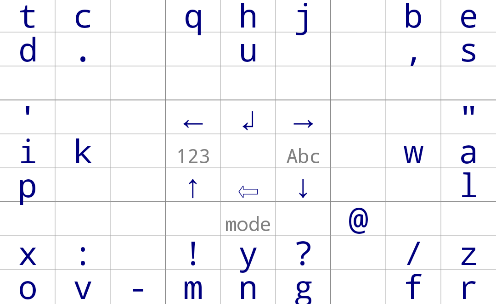

# Simple Keyboard

      
## About

My personal keyboard, based on work by Ken Perlin many years ago.

Features:
- Small size (< 100kb)
- Number row
- No permissions
- Ads-free
- Weird characters

## Credits

Licensed under Apache License Version 2

This keyboard is based on "Simple-Keyboard" at https://github.com/rkkr/simple-keyboard

Which in turn is based on AOSP LatineIME keyboard. You can get the original source code
in https://android.googlesource.com/platform/packages/inputmethods/LatinIME/
